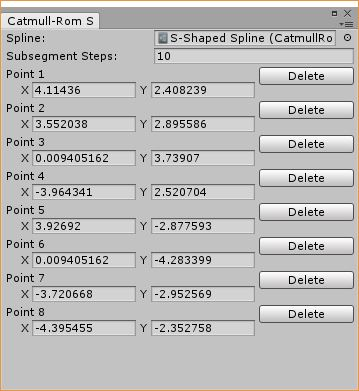
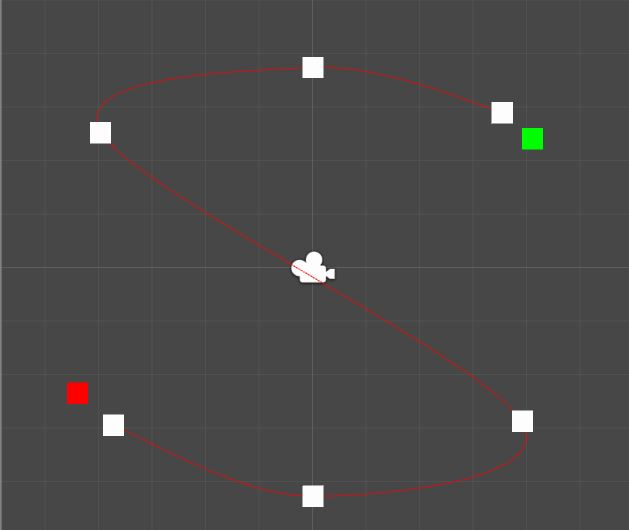

# CatmullRomSpline2D

Basic [Catmull-Rom splines](https://en.wikipedia.org/wiki/Cubic_Hermite_spline#Catmull%E2%80%93Rom_spline) for creating paths inside the Unity3d editor, and a simple editor script for them.

Catmull-Rom splines are really great for creating paths, because the generated curve always passes through all of the control points used to create it. (With the exception of the first and last, but you can easily work around that by doubling the first and last control points.)

## Usage

### Creating Splines

The Catmull-Rom spline objects are derived from Unity3D's ScriptableObject class, which makes it really easy generate them at design time, and then assign them to other game objects in the inspector. To create one, you can right-click in the Project window, and choose Create -> ScriptableObjects -> CatmullRomSpline2D. (Or you can find it in the Assets menu, if you prefer.)

Once you've created a CatmullRomSpline2D object, open up the "Catmull-Rom Spline Editor Window" from the Window menu. Drag the spline object you created before into the Spline field of the editor window. Splines are only displayed when selected in the editor window. Initially the splines are empty, so you need to add control points. With the editor window open and a spline selected, simply shift-click in the Unity3D Scene window to start adding points.



You can drag the control points around directly in the Scene window or edit them in the spline editor window. If you want to delete a point, click the delete button in the editor window. (More work is needed here. It would be nice to be able to reorder points or insert points in middle of a spline. Currently they're only added to the end.)



There's one more field to talk about in the editor window, called Subsegment Steps. This field determines how many steps we break each path segment between control points into when approximating the length of a spline path. If we use more subsegments the measurements will be more accurate but requires more processing time while editing splines and memory at runtime. Increase this number if your game objects are moving at uneven speeds across different segments of the spline paths.

Once you're done, you can drag a new spline object in and edit it, or close the editor window. The ScriptableObjects are serialized automatically, so there's nothing else you need to do.

### Using Splines

Okay, we've created some splines, let's see how to use them.

These splines are designed to be used as paths for game objects to move along. To find your position on the path, first you need to know what segment you are in by passing the distance along the path from the beginning. This will give you the current segment number and your position inside that segment.

```
	int segment;
	float s;
	path.GetSegment(distanceAlongPath, out segment, out s);
```

Next, you'll need to pass that data to the GetPosition method to receive a Vector2 of your position in world space.

```
	Vector2 position = path.GetPosition(segment, s);
```

Finally, if you'd like to know the direction of the path at that position, you can pass the segment info to that GetDirection method.

```
	var direction = path.GetDirection(segment, s);
```	

And that's it! There's a simple example solution in the demos folder showing a spaceship moving along first an S-shaped path and then a Z-shaped path. See [FollowPath.cs](../Demos/CatmullRomSpline2D/FollowPath.cs) for a code example.