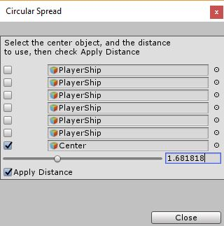

# GameObject Alignment

An editor tool for moving game objects around.

## Usage

There are currently two operations available. (Both found in the Tools -> GameObject Alignment menu.)

### Horizontal Spread

Select all of the game objects you want spread horizontally then select the Horizontal Spread menu item. (Their vertical positions will not be modified.) They will be spread evenly between the leftmost and rightmost objects in the selection group.

### Circular Spread

Select all of the game objects you want spread about a circle including the game object you want to use as the center of the circle. (Create an empty game object to use as a temporary placeholder if necessary.) Select the Circular Spread menu item. Check the box to identify which game object is the center anchor, then use the slider to set the distance. Finally check the "Apply Distance" box to move all of the object. (Note: Wait to set that until you select your center anchor object or you will start moving things around before you're ready.)

