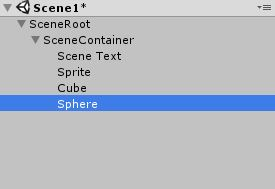

# SceneRoot

A container object used for asynchronous loading of Unity scenes.

Back in Unity 5, they added scene management and simplified the process for loading scene data without destroying your existing scenes. It's asynchronous, so doesn't cause your game to freeze, which is very nice.

Unfortunately, you don't get very precise control over when the new game objects are flipped on. The new scene is just added to your existing scenes as soon as the loading is finished. This can make transitions tricky to control.

## Usage

### Scene Setup

SceneRoot acts as a root container for everything in your scene that will be loaded, but we'll actually need two new game objects. Add the SceneRoot component to one, and in the inspector add the second one to the "Scene Container" field in SceneRoot. As the name suggests, this game object will be the container for all of the game objects in your scene.

Add all of game objects in your scene (except for the scene root object) as children to the scene container object. The scene container doesn't have any scripts to add, it can simply be an empty game object to work as a container. (But you're welcome to add any scripts to it that you want.)



Once you're finished working on your scene, before you save and move onto another scene, you need to disable your scene container object. The reason we do this is so that the scene data will be loaded into your game disabled, and then you can have full control over when it gets flipped on.

### Loading a Scene

Additively loading a scene with Unity's SceneManager involves a few steps:
1. Call SceneManager.LoadSceneAsync and retrieving a AsyncOperation
2. Waiting for the AsyncOperation to complete
3. (Optional) Enabling the data in the newly loaded scene

SceneRoot handles loading in a coroutine, and notifies you that the load is complete with a callback. When the scene is finished loading, we search for a SceneRoot object with the correct scene name, and send that off to the callback. Hold on to that SceneRoot, because you'll use it to start, stop, and unload the scene later.

```
class MyComponent : MonoBehaviour
{
    void LoadScene()
    {
        StartCoroutine(SceneRoot.LoadSceneCoroutine("SceneName", LoadComplete));
    }

    void LoadComplete(SceneRoot sceneRoot)
    {
    	addedScene = sceneRoot;
        Debug.Log("The scene is loaded!");
    }

    SceneRoot addedScene;
}
```

### Controlling Scenes

Starting a scene is as simple as enabling the scene container object in your SceneRoot. This is handled for you in SceneRoot.StartScene.

```
class MyComponent : MonoBehaviour
{
    void StartScene()
    {
    	addedScene.StartScene();
    }

    SceneRoot addedScene;
}
```

StartScene has an optional boolean setActiveScene parameter. Unity's SceneManager tracks which scene is set as the 'active' scene. This is the scene in your heirarchy where newly instantiated game objects will be added. If you want your newly loaded scene to be set as the active scene, you can pass true into StartScene. (The default is false.)

Stopping and unloading scenes is similarly simple. StopScene will disable your scene container object (and therefore all of its children game objects.) UnloadScene will remove the scene from memory.

```
class MyComponent : MonoBehaviour
{
    void StopScene()
    {
    	if(addedScene != null)
    		addedScene.StartScene();
    }

    void UnloadScene()
    {
    	if(addedScene != null)
	    	addedScene.UnloadScene();
    }

    SceneRoot addedScene;
}
```

If you set the scene as your active scene, keep in mind that StopScene might not catch all of the newly instantiated game objects. You'll need to be careful that they are added in the heirarchy under the scene container object (or one of its children.) Also, if you need fine control over the active scene, make sure you set the new active scene before you unload the current one.

### Cameras, Audio Listeners, and Testing

When you create a new scene in Unity, it adds a main camera with an audio listener component by default. When you start loading up multiple scenes you might start getting strange results when the cameras start wrestling for control of the rendering order. Additionally, Unity will complain at you for having multiple audio listener components.

The easiest solution to this problem is to just remove the camera and audio listener from your dynamic scenes, and rely on the existing camera in a main scene that never gets unloaded. This works perfectly well if you start running from the main scene, but removes the ability to test your scene in isolation. If you hit play in the Unity editor, you'll just be greeted with a message that the scene has no camera rendering.

Another solution that I'm using (and I'd love feedback on this) is to instead leave the camera in the dynamic scene, but disable it and add some sort of flag to let the scene root know that we'd like this game object to be enabled if the scene is ever loaded in isolation. If you add the IsolatedSceneEnable component to an object, the scene root will find it and enable it if the scene is ever launched in isolation. (Note: This search is only done when launched from the Unity editor.)

To determine if it has been launched in isolation, the scene root looks to see if the scene it belongs to is already set as the active scene in its Start method. This is before StartScene would be called, so this should only be possible if it was launched in isolation.

There's a simple example of swapping scenes in the Demos folder. If you want to see IsolatedSceneEnable in action, take a look at Scene2 in that demo.